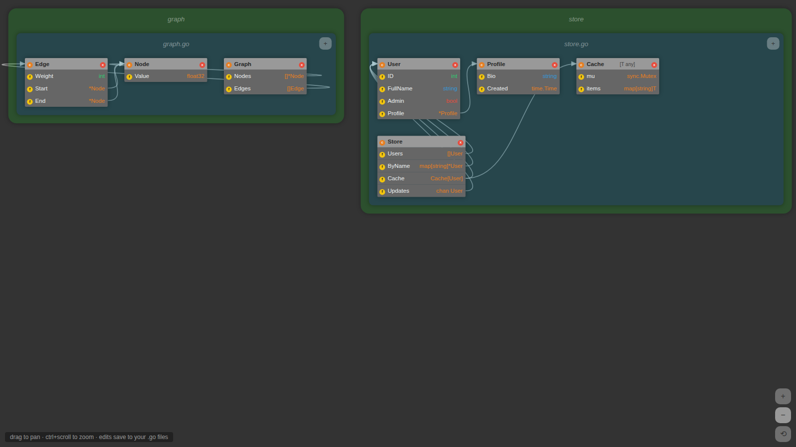

# go-diagram

A UML diagram editor for Go projects. Point it at a directory and it shows every struct, its fields, and the references between structs as a live diagram in your browser. Edits in the diagram (rename a struct or field, change a type, add or remove fields) are written back to your `.go` files, and changes to the files show up in the diagram within a couple of seconds.

> **Fork notice:** go-diagram was created by **Grant Timmerman and Anwell Wang** ([grant/go-diagram](https://github.com/grant/go-diagram)) as a 2016 college project. This fork modernizes the toolchain, fixes data-loss bugs in the write-back path, and adds tests, Docker, and CI. See [CHANGES.md](CHANGES.md) for what changed.



## Quick start

Requires Go 1.24+ and Node 20+.

```sh
# build the frontend
cd app && npm ci && npm run build && cd ..

# run against any Go project
go run . /path/to/your/go/project
```

The server listens on `http://127.0.0.1:8080` and opens your browser.

### Flags

| Flag | Default | Description |
|---|---|---|
| `-addr` | `127.0.0.1:8080` | Listen address. Localhost only by default, since the server writes files. |
| `-static` | `./app/dist` | Directory with the built frontend. |
| `-read-only` | `false` | Show the diagram but reject edits. |
| `-no-browser` | `false` | Don't open a browser on start. |

### Docker

```sh
docker build -t go-diagram .
docker run --rm -p 8080:8080 -v "$PWD":/project go-diagram
```

## Using the diagram

- **Pan:** drag the background or scroll. **Zoom:** ctrl/⌘ + scroll, or the buttons at the bottom right.
- **Edit:** click a struct name, field name, or type, type the new value, then press Enter (Esc cancels).
- **Add or remove:** `+` on a file adds a struct, `c` on a struct adds a field, `f` removes a field, `x` deletes a struct.
- **Invalid edits** (for example, a type that doesn't parse) are rejected. The file is left untouched, and the diagram reverts.

Struct tags, generic type parameters, embedded fields, imports, functions, and non-struct type declarations are preserved when a file is rewritten. Comments inside rewritten files are not preserved yet.

## Development

```sh
go run . -no-browser -addr 127.0.0.1:8080 ./example1   # backend
cd app && npm run dev                                   # frontend with hot reload (proxies /ws)
```

Tests:

```sh
go test -race ./...
cd app && npm test
```

## Architecture

- **`parse/`** walks the project with `go/parser`, turns struct declarations into JSON (packages → files → structs → fields), and records an edge for every field whose type refers to another struct in the project (including through pointers, slices, maps, channels, and generic instantiations). `WriteClientPackages` rebuilds only the struct declarations from edited JSON and re-prints the file with `go/format`.
- **`server.go`** serves the frontend and a websocket at `/ws`. Each connection polls a fingerprint of the project's `.go` files and pushes a fresh diagram when anything changes. Edits from the browser are validated and written under a mutex, and errors go back to the client.
- **`app/`** is React 19 + Redux Toolkit, built with Vite. A middleware owns the websocket, reconnects with backoff, and sends the updated package data after each edit. Edges are drawn as SVG curves measured from the rendered field rows.

## License

The original repository does not include a top-level license file (the frontend's `package.json` declares MIT). Changes in this fork are offered under the same terms as the original project.
